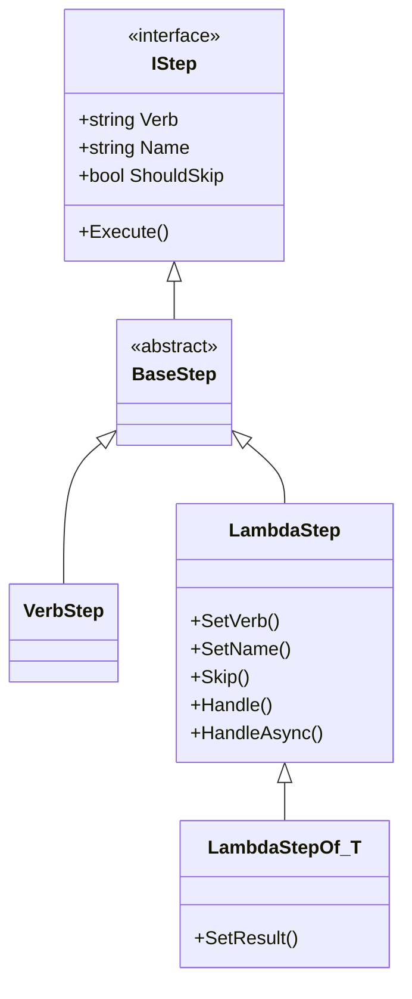

# Steps

All steps in DrillSergeant ultimately derive from `IStep`. To make things easier, There are two different types of steps: `VerbStep` and `LambdaStep`.

## Class Hierarchy



## About Steps

All steps are composed of a verb, name, and handler. When a behavior is execute, DrillSergeant will execute each step in the order they were added. There are four parts to this process:

1. Select the step handler to execute.
2. Map the context and input parameters to pass to the handler.
3. Execute the handler.
4. Save any changes made to the context back to the behavior's global state.

## Step Chaining

When defining behaviors there are two fluent API calls used to chain steps together:

- AddStep() -- Adds a single step to the behavior.
- Background() -- Adds a composite of steps to the behavior.

### AddStep()

Steps can be added to the behavior by calling `AddStep()` and passing an instance to the step to add.

```CSharp
var behavior =
    new Behavior()
        .AddStep(Step1)
        .AddStep(Step2)
        .AddStep(Step3);
```

### Implicit Steps

The `BehaviorBuilder` class has a `static` property `Current` which represents the current behavior being configured for the test. This property represents the actual behavior that DrillSergeant will execute for the test and is thread-safe to access. In addition to the extension methods that can be chained to build steps, there is also a `static` helper class `StepBuilder` which defines methods that operate on `BehaviorBuilder.Current` directly so that it is no longer necessary to reference it directly.

```CSharp
StepBuilder.Add("Given", "My Step", () => { });
```

To make things easier, DrillSergeant comes with built-in verb groups for Given/When/Then and Arrange/Act/Assert:

```CSharp
AAA.Arrange("Step 1", () => {} );
AAA.Act("Step 2", () => {} );
AAA.Assert("Step 3", () => {} );
```

This can be simplified by using C#'s `using static` import to bring the `AAA` or `GWT` classes into global space:

```CSharp
using static DrillSergeant.AAA;

// ...

Arrange("Step 1", () =>{} );
Act("Step2", () => {} );
Assert("Step 3", () =>{} );
```

### Background()

Sometimes a several behaviors may need to share the same setup steps. For example, let's say we need to test several behaviors on a website that all require a user to be logged in. Rather than repeat the steps to collect credentials and login with each step we can store them in a background behavior and reference that instead.

```CSharp
public Behavior LoggedInUser()
{
    return BehaviorBuilder.Build(_ =>
    {
        Given(GetUserCredentials)
        Given(LogUserIn);
    }
}

[Behavior]
public void TestSomeBehavior()
{
    BehaviorBuilder.Current
        .Background(LoggedInUser());

    Given(Step1)
    When(Step2)
    Then(Step3);
}

[Behavior]
public void TestSomeOtherBehavior()
{
    BehaviorBuilder.Current
        .Background(LoggedInUser());

    Given(OtherStep1)
    When(OtherStep2)
    Then(OtherStep3);
}

```

Because background steps are enumerated and added to the parent behavior they have the ability to access the context and input for the test like any other step can.

## Method Steps

Method steps are the easiest to use. Simply define your step as a regular function:

```CSharp
public void MyStep()
{
    // Step logic goes here.
}

public int AddValues(int a, int b)
{
    return a + b;
}
```

If you need to pass parameters to a regular method step, be sure to wrap the method in an outer function first.

```CSharp
Given("My Step", () => AddValues(a,b));
```

## Lambda Steps

Lambda steps provide extra flexibility. The basic form to create one is:

```CSharp
public LambdaStep MyStep(/* parameters */) =>
    new LambdaStep("My Step")
        .Handle(() =>
        {
            // Implementation goes here.
        });

public LambdaStep MyAsyncStep(/* parameters */) =>
    new LambdaStep("My Async Step")
        .HandleAsync(async () =>
        {
            // Implementation goes here.
        });
```

Both the async and non-async variants have the same overrides.

### Note About Verbs

When writing lambda steps it's preferred not to set the verb. This is because the extension methods (e.g., `Given`) will set it.

```CSharp
var step = new LambdaStep("My Step").SetVerb("When");

// ...

behavior.Given(step); // <-- calls SetVerb("Given") behind the scenes!
```

When the test is run, "My Step" will be reported as a "Given" step despite having been set to "When". This was a design decision specifically intended to avoid confusion when reporting. The reason for this is because in many instances the verb for an a step within a test is context-specific. For example, when testing the login functionality of a website, it would make sense to define a `LoginStep` using the "When" verb because that's what's being tested. However, when testing other behaviors that require a user to be logged in first, then contextually `LoginStep` should be treated as a "Given" since it's part of the behavior setup process. By giving the step chainer the ability to reset the verb, DrillSergeant can create more consistent execution reports.

If you absolutely do not want this behavior, there are two workarounds.

1. Use the `AddStep()` method. This will register the step as-is without resetting the verb.
2. Create a subclass of `LambdaStep` and `override` the `Verb` property.

## Verb Steps

Verb steps are convention-based classes that are inherited directly from `VerbStep`. Unlike lambda steps, the verb must be set by overriding the base property and will not be reset by the chaining methods.

It is not necessary (i.e., _DO NOT_) override the `Execute()` method. Rather, the handler must be defined as a public instance method with the same name as the verb. For example:

```CSharp
public class CheckStep : BaseStep
{
    public void Check()
    {
    }

    public override string Verb => "Check";
}
```

For more information on how handler resolution works, see [here](https://github.com/bitcobblers/DrillSergeant/wiki/Verbs#handler-resolution).
